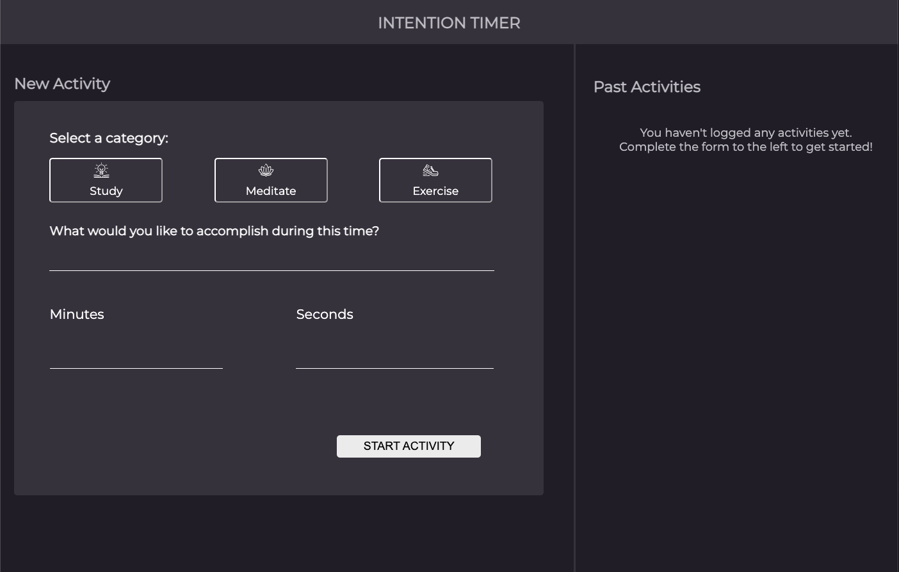
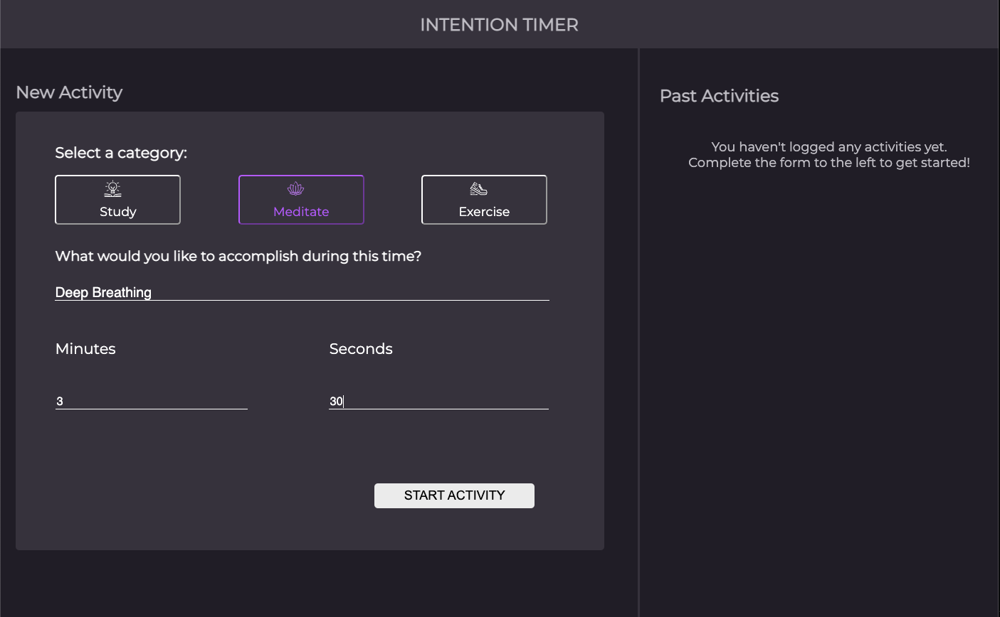
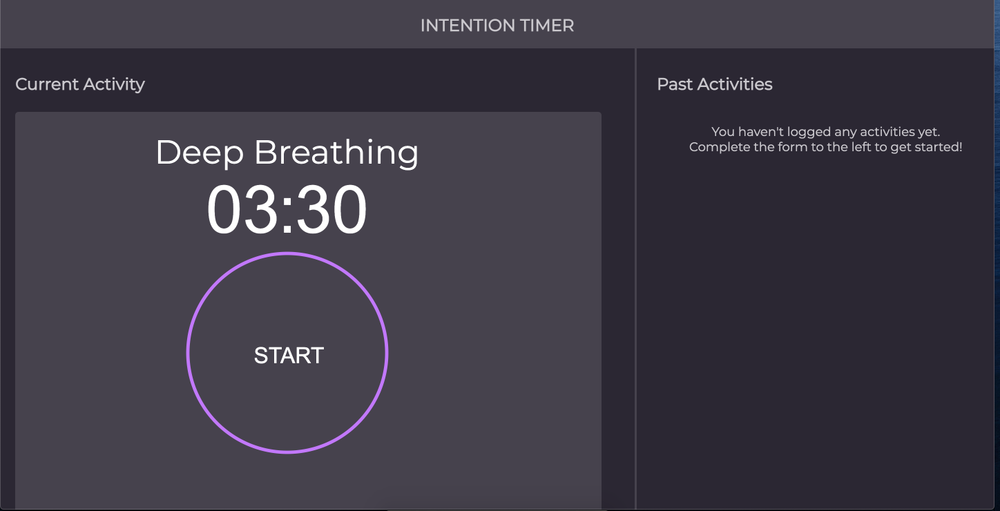
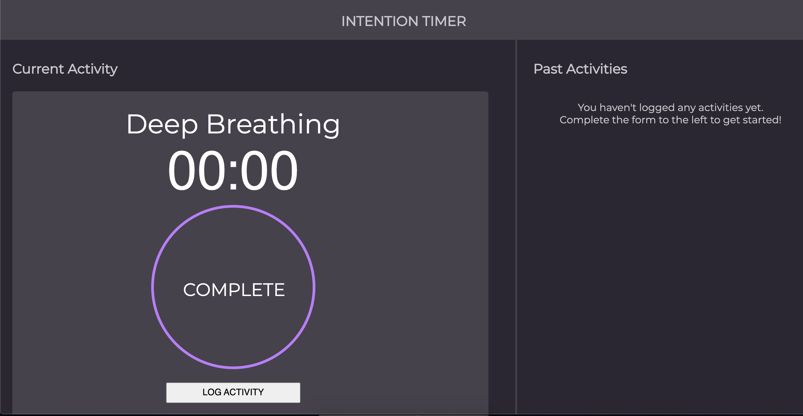
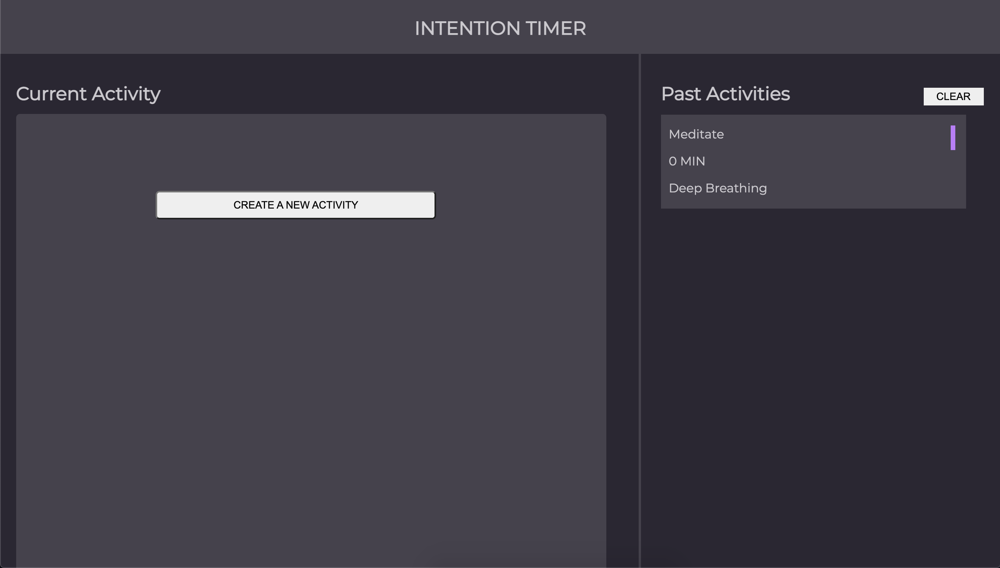

# Project Title
### Intention Timer

## Description
An activity based website where the user can choose from three different activity categories and set a timer for the chosen activity. The user is able to select study, meditate, or exercise and then describe what they would like to accomplish during their activity time. Once they add the description, the user can then set the mintues and seconds for the chosen activity. A countdown timer will then appear which the user will need to start using the start button. After the timer has expired, the user is able to save the accomplished activity in the past activities box. The user has the ability to come back and see past activites that they have accomplished.

### Dependencies
The user will need access to the internet, and to follow the this link

### Installing
[Our program is located on GitHub under deployed link](https://daomeow.github.io/intention-timer/)
This program does not need to be motified or adjusted beforehand by the user.

### Executing program
1. **Select** a category type of the activity you would like to accomplish
2. Write a brief description of the activity
3. Enter the amount of time and **click** the start activity button to move to the next page

4. On the Current Activity page, start the timer by **selecting** the start button

5. After the Log  Activity button is clicked, the activity will be displayed in the Past Activities’ sidebar

6. **Select** the Create a New Activity button to return to the homepage 

## Help
Fill out all of the input fields (desciption of what you would like to accomplish, minutes and seconds) before you have the ability to start the activity.

## Authors
Chuck Morris [@percworld]
Bryan Hohn [@bhohnco]
Melanie Daoheuang [@daomeow] (edited)

